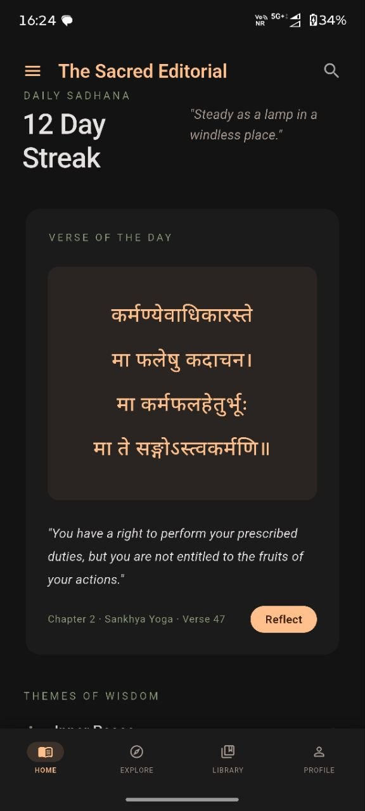
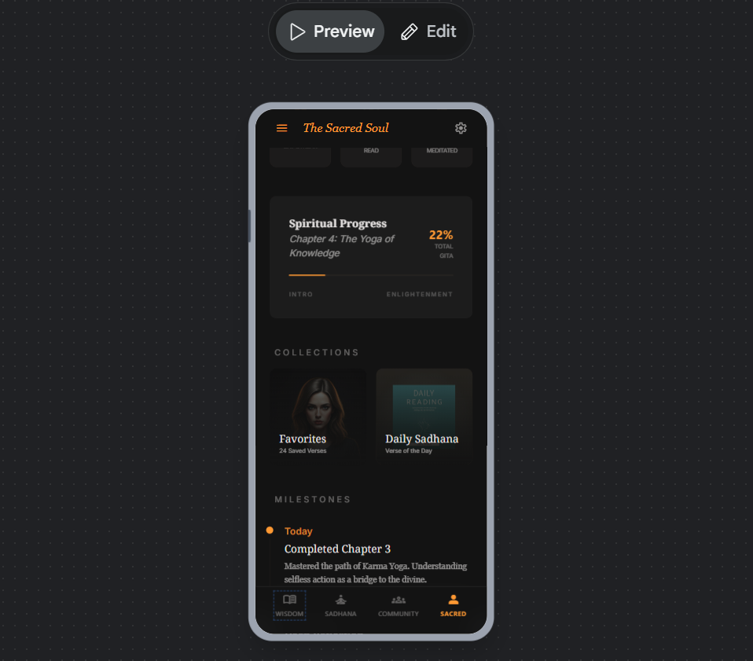

# app--Full-User-Centric-Product-Design-
A calm, offline-first Bhagavad Gita reading app built with Flutter. Uses Clean Architecture, Riverpod, Hive, and Supabase. Focused on a manuscript-like reading experience with thoughtful typography, smooth interactions, and seamless sync for bookmarks and collections.

<div align="center">

# 📖 Shrimad Bhagavad Gita

### A production-grade, offline-first sacred reading companion — built with Flutter & Clean Architecture.

[](https://flutter.dev)
[](https://dart.dev)
[](https://riverpod.dev)
[](https://supabase.com)
[](https://hivedb.dev)
[](LICENSE)

*"A digital sanctuary for the timeless wisdom of the Bhagavad Gita."*

---

</div>

## 📸 Screenshots / Videos

| Section | Preview |
|--------|---------|
| App Till Now (In the process) see 👉| <a href="https://vimeo.com/1214180029?share=copy&fl=sv&fe=ci"></a> |
| Preview the Prototype On Stitch | <a href= "https://stitch.withgoogle.com/preview/10067144196159841889?node-id=58a774df3d3f4a709e5db87c82cb50b7"> </a> |

## 🌟 About the Project

**Shrimad Bhagavad Gita** is a thoughtfully designed mobile app that brings the 18 chapters and 700 verses of the Bhagavad Gita to your fingertips — beautifully, offline, and without compromise.

The project is built from the ground up with a strong emphasis on **software architecture, user experience, and long-term maintainability**. Rather than a quick prototype, this app is being developed step-by-step following Clean Architecture principles — with a clear separation between the domain logic, data handling, and presentation layers. The design language, called **"The Sacred Editorial"**, treats every screen like a page in a bespoke manuscript — generous whitespace, tonal surfaces, dual serif typography, and meditative animations.

> This is a **personal learning project** where I am exploring Flutter development with a strong focus on good engineering practices — Clean Architecture, offline-first patterns, reactive state management, and scalable backend integration.

---

## 🎯 Project Goals

- Build a **truly offline-first** reading experience — the app must work fully without any internet connection
- Apply **Clean Architecture** rigorously so the codebase remains maintainable and backend-agnostic
- Create a UI that feels **premium and meditative** — not just functional, but experiential
- Implement a **real cloud sync system** that gracefully handles connectivity failures
- Learn and apply **production-level Flutter patterns** end to end

---

## ✨ Features

### ✅ Implemented

| Feature | Details |
|---|---|
| 🏛️ **Clean Architecture** | Strict 3-layer separation (Presentation → Domain → Data). UI has zero knowledge of APIs or database internals. |
| 🎨 **"Sacred Editorial" Design System** | Custom color palette, tonal surface hierarchy, dual-font typography (Noto Serif Devanagari + Inter), meditative animations (300ms+), and a strict "No-Line Rule" enforced at the theme level. |
| 📖 **Chapter Browser** | All 18 Gita chapters with Sanskrit/English titles, verse counts, editorial progress badges (Not Started / In Progress / Completed), and an overall progress indicator. |
| 🔤 **Verse (Shlok) Reader** | Per-chapter verse list with Sanskrit preview. Detail screen shows full Devanagari text, transliteration, and English translation. |
| 🔖 **Bookmarks** | Save individual verses with optional personal notes. Bookmark state is reactive (instant UI updates via Riverpod `StreamProvider`). |
| 🗂️ **Collections** | Organize bookmarks into named collections. Uses a junction-table model (`Collection` + `CollectionItem`) for future reordering and multi-collection support. |
| 💾 **Offline-First (Hive)** | All content and user data is stored locally in Hive. The app is fully functional with no internet. |
| 🔐 **Authentication (Supabase)** | Email/password sign-up and login. Session is persisted locally — no re-login needed between app restarts. |
| ☁️ **Cloud Sync with Offline Queue** | Writes go to Hive first, then sync to Supabase in the background. If offline, operations are pushed to a `PendingSyncQueue` (Hive-backed) and replayed when connectivity is restored. |
| 🏠 **Home Screen** | Daily Sadhana streak counter, Verse of the Day, Themes of Wisdom, Continue Reading card, and Curated Insights section. |
| 🧭 **App Shell + Navigation** | Custom bottom navigation bar with an amber "pill" active indicator, meditative scale/fade animation, and shell-route architecture for correct nested navigation. |
| 👤 **Profile Screen** | Stats display (Day Streak, Verses Read), My Collections quick-access, and Milestones timeline. |
| 📚 **Library Screen** | "Personal Archives" layout showing bookmarks and collections, with a `+ New Collection` prompt. |
| ⚙️ **Settings (Theme Switching)** | Light/Dark mode toggle, persisted to Hive — theme applies immediately on the first frame without flicker. |
| 🔀 **Deep-Link Ready Routing** | GoRouter with `ShellRoute` for nested navigation. Auth-aware redirect logic prevents login screen flash on startup. |

### 🚧 In Progress / Planned

| Feature | Status |
|---|---|
| 🔍 **Search Screen** | Route and `SearchShloks` use case exist; UI wiring and live filtering pending |
| 📋 **Collections UI (Full)** | Add-to-collection flow from the Shlok detail screen; `CollectionItem` query display in Library |
| 📊 **Real Reading Progress Tracking** | Transition from mocked `chapterProgressProvider` to a real `ReadingProgressRepository` backed by Hive + Supabase |
| 📅 **Streak & Activity Tracking** | Actual "Days Meditated" and "Minutes Read" stats, replacing current static placeholders |
| 🔔 **Notifications** | Daily verse reminder (button present, not yet wired) |
| 🔒 **Account Security** | Password change / account management flow |
| 🛤️ **Curated Journeys** | Pre-built thematic reading plans (e.g., "Path of Devotion") |

---

## 🏗️ Architecture

This project follows **Clean Architecture** — a layered approach that keeps the business logic completely independent of frameworks, databases, or APIs.

```
┌──────────────────────────────────────┐
│         Presentation Layer           │  ← Flutter Widgets, Riverpod Providers
│   (UI only knows Domain entities)    │
└─────────────────┬────────────────────┘
                  │ calls
┌─────────────────▼────────────────────┐
│           Domain Layer               │  ← Pure Dart: Entities, Repository Interfaces, Use Cases
│    (No Flutter, No Hive, No HTTP)    │
└─────────────────┬────────────────────┘
                  │ implemented by
┌─────────────────▼────────────────────┐
│            Data Layer                │  ← DTOs, Hive adapters, Supabase calls, Mappers
│   (Knows about APIs and databases)   │
└──────────────────────────────────────┘
```

**Key principle:** You can swap the entire backend (e.g., replace Supabase with Firebase, or a custom REST API) without touching a single line of UI or domain code.

### Folder Structure

```
lib/
├── core/
│   ├── constants/        # App-wide constants, route paths, Hive box keys
│   ├── errors/           # Typed Failure classes (Network, Server, Cache, Auth...)
│   ├── network/          # Dio client setup
│   ├── providers/        # Root Riverpod provider wiring (all repositories)
│   ├── router/           # GoRouter config with auth-aware redirects
│   ├── settings/         # Settings model, repository, and provider
│   ├── shell/            # AppShell widget + custom bottom navigation
│   ├── sync/             # SyncService + PendingSyncQueue (offline mutation replay)
│   ├── theme/            # Full Sacred Editorial design system
│   │   └── widgets/      # SectionContainer, GlassContainer, SacredButton, etc.
│   └── utils/            # Result<T> sealed type, UseCase base class
│
└── features/
    ├── auth/             # Login/Signup — domain, data, presentation
    ├── bookmarks/        # Bookmark CRUD — domain, data, presentation
    ├── chapters/         # Chapter list — domain, data, presentation
    ├── collections/      # Collections + CollectionItems — domain, data, presentation
    ├── home/             # Home screen
    ├── profile/          # Profile screen
    ├── search/           # Search (use case + screen scaffold)
    ├── settings/         # Theme settings
    └── shloks/           # Verse list + detail — domain, data, presentation
```

---

## 🛠️ Tech Stack

| Layer | Technology | Why |
|---|---|---|
| **Framework** | Flutter (latest stable) | Cross-platform, expressive UI |
| **State Management** | Riverpod 2.x | Compile-safe, testable, no context drilling |
| **Local Database** | Hive | Fast, offline-first, typed boxes with code-gen adapters |
| **Backend / Auth** | Supabase | Postgres-backed, real-time sync, easy auth |
| **HTTP Client** | Dio | Interceptors, retry logic, easy base URL swapping |
| **Navigation** | GoRouter | Declarative, deep-link ready, shell routes |
| **Error Handling** | Sealed `Result<T>` | No thrown exceptions reach the UI — ever |
| **Typography** | Noto Serif Devanagari + Noto Serif + Inter | Bundled locally (offline, no runtime downloads) |

---

## 🎨 Design System — "The Sacred Editorial"

The UI is built on a custom design system that rejects generic Material defaults.

| Rule | Implementation |
|---|---|
| **No-Line Rule** | Borders are globally disabled via `DividerTheme(color: transparent)`. Separation is done through tonal surface shifts only. |
| **Surface Hierarchy** | `SectionContainer(tier: SurfaceTier.X)` — developers never pick hex colors manually. |
| **Meditative Animations** | All transitions are ≥ 300ms with `easeOutCubic`. Enforced via `AppAnimations` constants. |
| **Semantic Typography** | `NotoSerifDevanagari` → Sanskrit text. `NotoSerif` → English wisdom. `Inter` → UI/utility labels. |
| **Glassmorphism** | `GlassContainer` widget with `BackdropFilter`, `RepaintBoundary` isolation, and a solid fallback for low-end devices. |

---

## 🔄 Offline Sync Architecture

```
User Action
    │
    ▼
Write to Hive (immediate, UI updates instantly)
    │
    ├─── Online? ──► Fire-and-forget upsert/delete to Supabase
    │
    └─── Offline? ──► Push to PendingSyncQueue (Hive-backed)
                              │
                              └─── On reconnect → replay queue → Supabase
```

On login, `SyncService.hydrate()` pulls the user's cloud data and overwrites local Hive — so bookmarks and collections are always in sync across devices.

---

## 🚀 Getting Started

### Prerequisites
- Flutter SDK `^3.7.2`
- Dart SDK `^3.7.2`
- A Supabase project (for auth + cloud sync features)

### Setup

```bash
# 1. Clone the repository
git clone https://github.com/YOUR_USERNAME/shrimadbhagvadgeeta.git
cd shrimadbhagvadgeeta

# 2. Download and bundle fonts (required for correct typography)
powershell -File scripts/download_fonts.ps1

# 3. Uncomment the fonts section in pubspec.yaml (see comments in the file)

# 4. Install dependencies
flutter pub get

# 5. Configure Supabase
# Open lib/main.dart and add your Supabase URL and anon key
# (See: https://supabase.com/dashboard → your project → Settings → API)

# 6. Run the app
flutter run
```

### Supabase Schema

Run the following SQL migrations in your Supabase SQL editor:

```sql
-- Bookmarks table
create table public.bookmarks (
  id text primary key,
  user_id uuid references auth.users not null,
  shlok_id text not null,
  note text,
  created_at timestamptz default now()
);

-- Collections table
create table public.collections (
  id text primary key,
  user_id uuid references auth.users not null,
  name text not null,
  created_at timestamptz default now()
);

-- Collection items (junction table)
create table public.collection_items (
  id text primary key,
  collection_id text references public.collections on delete cascade not null,
  shlok_id text not null,
  "order" int default 0,
  added_at timestamptz default now()
);

-- Enable Row Level Security
alter table public.bookmarks enable row level security;
alter table public.collections enable row level security;
alter table public.collection_items enable row level security;

-- Policies (users can only access their own data)
create policy "Own bookmarks" on public.bookmarks for all using (auth.uid() = user_id);
create policy "Own collections" on public.collections for all using (auth.uid() = user_id);
create policy "Own collection items" on public.collection_items for all using (
  exists (select 1 from public.collections where id = collection_id and user_id = auth.uid())
);
```

---

## 📐 Domain Entities

```dart
// Shlok — the atomic unit of content
Shlok {
  id: "BG_2_47",       // Stable, API-agnostic identifier
  chapterId: "BG_2",
  verseNumber: 47,
  sanskritText: "कर्मण्येवाधिकारस्ते...",
  transliteration: "karmaṇy-evādhikāras te...",
  translation: "You have a right to perform your prescribed duties...",
  commentary: String?   // Optional Swami commentary
}

// Bookmark — user-specific, independent of collections
Bookmark { id, shlokId, createdAt, note? }

// Collection + CollectionItem — junction-table pattern
Collection { id, name, createdAt }
CollectionItem { id, collectionId, shlokId, order, addedAt }
```

---

## 📊 Current Progress

```
Phase 1 — Foundation (Architecture + Design System)   ██████████ 100%
Phase 2 — Domain Layer (Entities + Interfaces)        ██████████ 100%
Phase 3 — Data Layer (Hive + Supabase + Mappers)      ██████████ 100%
Phase 4 — Core Features (Chapters, Verses, Read)      ██████████ 100%
Phase 5 — User Features (Bookmarks, Collections)      ████████░░  85%
Phase 6 — Auth + Cloud Sync                           ██████████ 100%
Phase 7 — UI Polish (All Screens)                     ████████░░  85%
Phase 8 — Search + Progress Tracking                  ███░░░░░░░  30%
Phase 9 — Notifications + Journeys                    ░░░░░░░░░░   0%
```

---

## 🤝 Contributing

This is a personal learning project and is not currently open for contributions. Feel free to fork, explore the architecture, or use it as a reference for your own Flutter + Clean Architecture projects.

---

## 📝 License

This project is licensed under the MIT License — see the [LICENSE](LICENSE) file for details.

---

<div align="center">

Built with 🧡 and a lot of chai — exploring Flutter, Clean Architecture, and the wisdom of the Gita.

*"You have a right to perform your prescribed duties, but never claim ownership over the results." — Bhagavad Gita 2.47*

</div>
